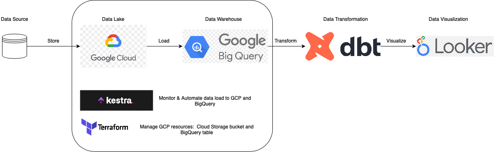
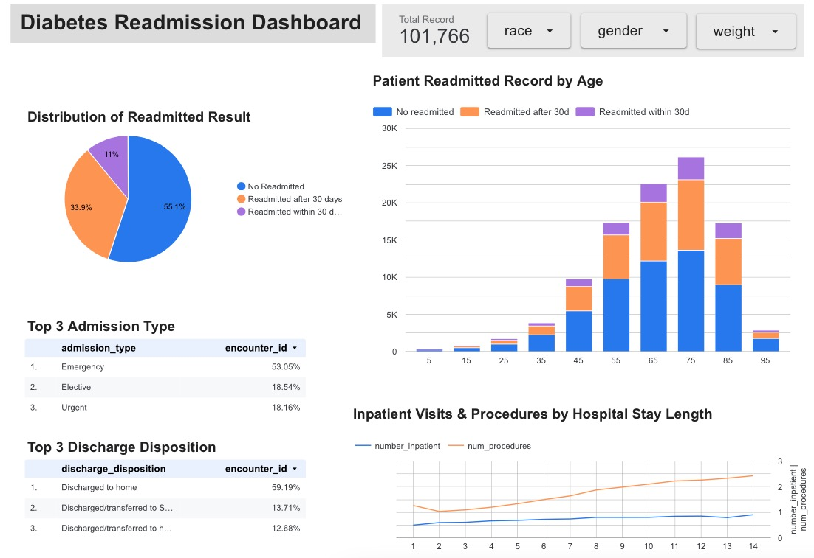
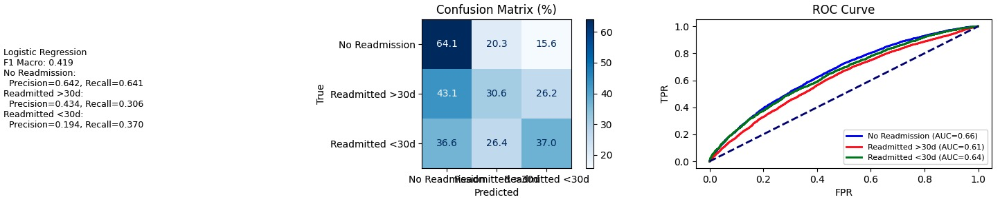
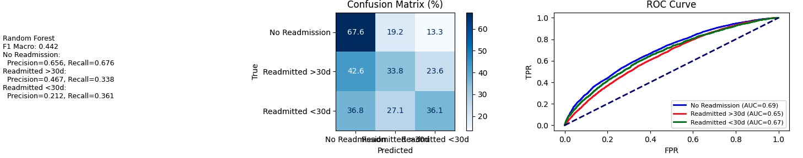
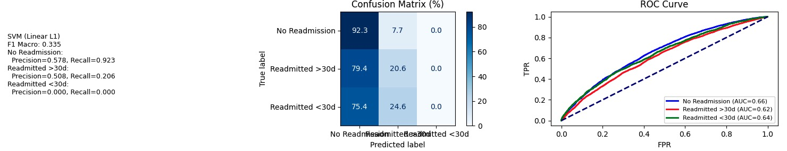
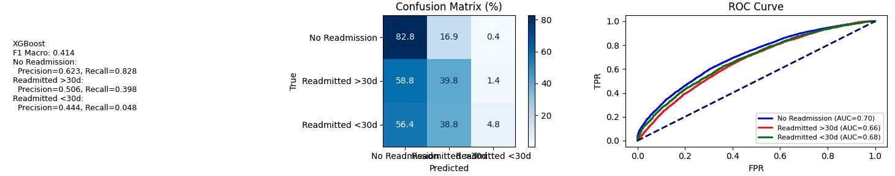
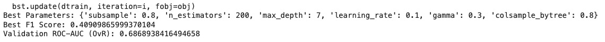
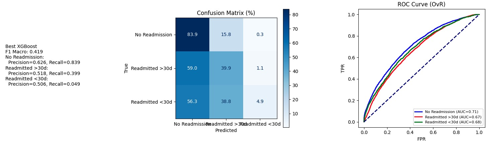

# diabetes-readmission-ml-pipeline

## Project Goal ##
This project implements an end-to-end data pipeline to predict 30-day hospital readmission risk for patients with diabetes, using Terraform, Kestra, Google Cloud Storage, BigQuery, dbt,Looker Studio and ML models.

---

## Architecture & Workflow ##
<div align="center">
  
</div>

1. Extract diabetes data through APIs from multiple sources, include [data.gov](https://catalog.data.gov/dataset/diabetes), [Mendeley Data](https://data.mendeley.com/datasets/wj9rwkp9c2/1) and [UCI](https://archive.ics.uci.edu/ml/datasets/Diabetes+130-US+hospitals+for+years+1999-2008#). 
2. Store data in **Google Cloud Storage** as a data lake.
3. Automates GCP resources (Cloud Storage Bucket and BigQuery dataset) using **Terraform**.
4. Load data into a structured data warehouse, **BigQuery** for scalable querying.
5. Transform data using **dbt** in BigQuery for analytical use. 
6. Performed **machine learning modeling** (Logistic Regression, Random Forest, SVM, and XGBoost) on the UCI dataset using Jupyter Notebook in Google Colab.
7. Visualizes key metrics through an interactive dashboard built with **Looker Studio**.

---

## Tech Stack ##
| Component | Technology |
|:----------|:------------|
| **Data Storage** | Google Cloud Storage (GCS) |
| **Data Warehouse** | BigQuery (External Table on GCS) |
| **Orchestration** | Kestra |
| **Transformations** | dbt |
| **Infrastructure as Code** | Terraform |
| **Visualization** | Looker Studio |
| **Containerization** | Docker |

---

## Implementation ##

#### Create Cloud Composer environment  
```bash
export PROJECT_ID="your-gcp-project"
export REGION="your-region"
export ENV_NAME="composer-env"

gcloud composer environments create $ENV_NAME \
    --location $REGION \
    --image-version composer-2.11.5-airflow-2.10.2 \
    --project $PROJECT_ID
```
## Data Lake: Google Cloud Storage 
The dataset is downloaded from Kaggle and stored in a Google Cloud Storage bucket using Airflow.  
#### Code Snippet
```python
def create_bucket(bucket_name, gcp_conn_id=GCP_CONN_ID):
    hook = GCSHook(gcp_conn_id=gcp_conn_id)
    hook.create_bucket(bucket_name=bucket_name)

def upload_file(bucket_name, source_file, gcp_conn_id=GCP_CONN_ID):
    hook = GCSHook(gcp_conn_id=gcp_conn_id)
    destination_blob = os.path.basename(source_file)
    hook.upload(
        bucket_name=bucket_name,
        object_name=destination_blob,
        filename=source_file
    )
    return f"gs://{bucket_name}/{destination_blob}"
```
## Data Warehouse: BigQuery
The CSV file stored in Google Cloud Storage is loaded into a BigQuery table using Kestra.    
#### Code Snippet
```python
# Initialize BigQuery client
client = bigquery.Client(project=PROJECT_ID)
# Configure the load job
job_config = bigquery.LoadJobConfig(
    source_format=bigquery.SourceFormat.CSV,
    skip_leading_rows=1,  # skip header row
    autodetect=True,       # automatically detect schema
)
# Load CSV from GCS into BigQuery
load_job = client.load_table_from_uri(
    GCS_URI,
    f"{PROJECT_ID}.{DATASET_ID}.{TABLE_ID}",
    job_config=job_config
)
load_job.result()
```

## Data transformation: dbt in BigQuery 
#### Identify functions on each layer:

- **Staging layer:** 
  1. Rename columns.
  2. Handle missing values.
  3. Initial data type casting
  4. Standardize categorical values.

- **Intermediate layer:** 
  1. Convert text categories to numeric ranges.
  2. Map lab results to ranges or categories.
  3. Aggregate visit counts.

- **Analytical layer:**
  1. Encode categorical features: one-hot,label encoding.
  2. Scaling.
  3. Prepare target variable.

#### Build and Run the dbt transformations
```bash
dbt build --select patient_features.sql
dbt run
```
This process materializes the transformed data as a table in BigQuery, ready for analysis in Looker Studio.

## Data Visulization in Looker Studio
<div align="center">
  
</div>

---

## Dateset for ML Model ##

The dataset represents 10 years (1999-2008) of clinical care at 130 US hospitals and integrated delivery networks. It includes over 50 features representing patient and hospital outcomes.

Background:
In 2011, 3.3M U.S. patients were readmitted within 30 days, costing $41B; diabetes alone accounted for $250M in readmission costs, so spotting high-risk patients early can help prevent them.

Feature:
Key attributes include de-identified patient ID, race, gender, age, admission type, length of stay, admitting physician’s specialty, number of lab tests, HbA1c results, diagnoses, number of medications, use of diabetic drugs, and counts of outpatient, inpatient, and emergency visits in the year prior to hospitalization, etc.

Target Variable:
Readmission status, categorized as:
- **"<30"** - readmitted within 30 days
- **">30"** — readmitted after 30 days
- **"No"** — no readmission record

This is a three-class classification problem.

Source:

Beata Strack, Jonathan P. DeShazo, Chris Gennings, Juan L. Olmo, Sebastian Ventura, Krzysztof J. Cios, and John N. Clore, “Impact of HbA1c Measurement on Hospital Readmission Rates: Analysis of 70,000 Clinical Database Patient Records,” BioMed Research International, vol. 2014, Article ID 781670, 11 pages, 2014.

https://archive.ics.uci.edu/ml/datasets/Diabetes+130-US+hospitals+for+years+1999-2008#

---

## ML Models ##

### Schema Review

### Data Cleaning
  - Drop features with high missing values percent (>96%). 
  - Drop unbalanced features with more than 95% of same value.
  - NaN values are replaced with 'None' for later ICD-9-based categorical mapping.

### Feature Engineering
  There are 3 types of features in this dataset: **numerical**(lab result), **categorical**(diag), and **textual**(clinical notes). I focus on numerical and categorical. 
  1. Use **numeric midpoints** to convert `age` bucket for ML model, like logistic regression, XGBoost and NN etc..
  2. Impute missing value.
  3. Convert to appropriate data types:`A1Cresult`, `max_glu_serum`, `change`, `diabetesMed` and 7 drugs and target label `readmitted` for modeling.
  For **Numerical features**: 
  4. Encode categorical variables for `admission_type_id`, `discharge_disposition_id`, and `admission_source_id` using dataset's ICD-9 code.

### Exploratory Data Analysis
  1. Use numerical features to generate correlation heatmap. 
  2. Identify 4 strongest correlations pairs.
  3. The target label `readmitted` shows weak correlations with all features, likely because it is categorical and Pearson correlation cannot capture non-linear or complex relationships.
  4. Patient analysis in demographics and utilization history etc. 
  5. Perform **Hypothesis Testing** to test whether there are statistically significant differences in healthcare utilization across readmission groups (No readmission, >30 days, <30 days). Applied features including `time_in_hospital`, `num_lab_procedures`, `num_procedures`, `num_medications`, `number_outpatient`, `number_emergency`, `number_inpatient`. 

## Data Preprocessing for ML Model
  1. Drop identifiers `patient_nbr` and `encounter_id`.
  2. Group 800+ ICD-9 codes in `diag_1`, `diag_2` and `diag_3` into 18 broad health categories to simplify features and improve model interpretability.
  3. Applied one-hot encoding to transform categorical variables `race` `gender` into numerical dummy variables.
  5. Scale features.
  6. Split data:  70% for train data, 15% for validation data and 15% for test data

### Model Training
  1. Logistic Regression
  <div align="center">
  
  </div>

  2. Random Forest
  <div align="center">
  
  </div>

  3. SVM linear
  <div align="center">
  
  </div>

  4. XGBoost (multi-class)
  <div align="center">
  
  </div>

  Performance Comparison: XGBoost is selected for its high predictive accuracy, ability to capture non-linear relationships, and robustness against overfitting.

### Hyperparameter Tuning
  1. Select parameters to tune: 
    - n_estimators (number of trees)
    - max_depth (depth of each tree)
    - learning_rate (shrinkage factor)
    - subsample (fraction of samples per tree)
    - colsample_bytree (fraction of features per tree)
    - gamma (minimum loss reduction for a split)
  2. Tunning Method: RandomizedSearchCV for faster search on large grids.
  3. Evaluation metric: f1_macro and roc_auc_ovr.
  Best XGBoost: 
  <div align="center">
  
  </div>
  <div align="center">
  
  </div>
